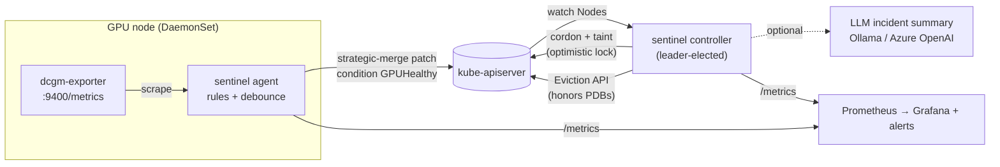

# GPU Fleet Sentinel

[](https://github.com/Nags-gk/gpu-fleet-sentinel/actions/workflows/ci.yaml)
[](https://github.com/Nags-gk/gpu-fleet-sentinel/releases)
[](https://goreportcard.com/report/github.com/Nags-gk/gpu-fleet-sentinel)
[](LICENSE)

**Automated GPU node health detection and safe remediation for Kubernetes.**
A Go node agent reads NVIDIA DCGM telemetry, detects hardware faults (XID errors,
uncorrectable ECC, row-remap failures, thermal events, missing GPUs), and a
controller-runtime controller quarantines bad nodes (cordon, taint, drain via
the Eviction API) without ever taking down more of the fleet than a configured
disruption budget allows.

On a large training cluster one bad GPU can stall a job running on thousands of
GPUs. The goal is to get a faulty node out of the scheduling pool in minutes, move
its workloads, and put it back automatically once it is healthy, without a
human in the loop and without a flapping sensor or a crashed exporter draining
healthy nodes.



## What it does

| Stage | Behavior |
|---|---|
| **Detect** | Agent scrapes dcgm-exporter every 15s and evaluates rules: hardware XIDs (48, 63, 64, 74, 79, 92, 94, 95, 119, 120) are critical; app-level XIDs (13, 31, 43) are warnings. Double-bit ECC, row-remap failure, temperature, SBE/NVLink CRC error *rates*, and missing GPUs are also covered. |
| **Debounce** | A node turns unhealthy after N consecutive critical samples and recovers only after M good ones (hysteresis), so one noisy reading never drains a node. |
| **Publish** | The agent writes a `GPUHealthy` node condition with a **strategic merge patch** keyed on condition type, so it never overwrites the kubelet's own conditions. Lost telemetry reports `Unknown`, never `False`. |
| **Decide** | A pure, fully unit-tested policy function chooses `Wait / Quarantine / Defer / Release` from node health, a grace period, a recovery period, heartbeat staleness, and the fleet-wide disruption budget. |
| **Remediate** | Cordon + `gpu-sentinel.io/unhealthy:NoSchedule` taint (optimistic-locked patch), then evict GPU pods through the Eviction API so PodDisruptionBudgets are honored. DaemonSet and mirror pods are skipped. |
| **Explain** | On quarantine, writes an incident summary to the node (runbook template by default; optionally an LLM via any OpenAI-compatible endpoint: Ollama, vLLM or Azure OpenAI, with automatic fallback). |
| **Recover** | After the recovery period the controller removes only what it added. A node a human had already cordoned stays cordoned. |
| **Observe** | Prometheus metrics, a Grafana dashboard, and alert rules with runbook links. |

## Per-pool policy with `GPUNodePolicy`

Controller flags (or Helm `controller.*`) set the fleet-wide default. For pools that
need different behavior, create a cluster-scoped `GPUNodePolicy`; fields you leave out
inherit the default:

```yaml
apiVersion: gpu-sentinel.io/v1alpha1
kind: GPUNodePolicy
metadata: {name: training-h100}
spec:
  nodeSelector: {matchLabels: {pool: training}}
  gracePeriod: 1m
  maxUnavailable: 1
  dryRun: false
```

```console
$ kubectl get gpunodepolicies
NAME            MANAGED   UNHEALTHY   QUARANTINED   BUDGET   DRYRUN   READY   AGE
training-h100   64        2           1             1        false    True    3d
```

- **Each policy has its own disruption budget.** A node counts toward the first matching policy (by name) and the flag default is last, so overlapping selectors cannot double-spend a budget.
- **Unsafe specs are rejected at admission** by CEL rules in the CRD: an empty `nodeSelector` (it would match the control plane too), negative or malformed durations, percentages over 100. The controller re-validates, and a node under an invalid policy is left alone rather than handled with settings nobody asked for.
- `status` reports managed / healthy / unhealthy / quarantined counts, the budget, and `Ready` and `BudgetExhausted` conditions. More examples: [deploy/examples](deploy/examples/gpunodepolicy.yaml).
- Without the CRD installed the controller runs from flags exactly as before.

### Automated repair (opt-in)

Most latched GPU faults (a critical XID, uncorrectable ECC) clear only when the GPU is
reset, so a quarantined node stays out until someone reboots it. Add an `escalation`
block to a policy to automate that, within hard limits:

```yaml
spec:
  escalation: {after: 15m, maxAttempts: 2, cooldown: 20m, maxConcurrent: 1}
```

A node still unhealthy `after` quarantine is rebooted, up to `maxAttempts` times
inside `historyWindow` (24h), `cooldown` apart and `maxConcurrent` at a time. Then it is
flagged `gpu-sentinel.io/replacement-requested` and never touched again. Safety gates:
reboots only happen on a node that is already cordoned and tainted, **fully drained
through the Eviction API** (PDBs honored, CPU pods included, terminating pods waited out),
and with a stale or unknown agent the controller does nothing. Attempts are recorded
*before* acting and survive release, so neither a crash nor a flapping node can cause an
unbounded reboot loop.

*How* the reboot happens is pluggable. `controller.escalation.actuator=annotation`
(default) only sets `gpu-sentinel.io/reboot-requested` on the node for your own
automation (a reboot daemon, a Cluster API remediation) and needs no extra privileges.
`pod` has the controller run a privileged `nsenter ... systemctl reboot` pod on the
node; it requires a namespace that permits privileged pods and is off unless you choose it.
Replacement is always a request, never an automatic node deletion.

## Safety properties (each covered by tests, including property tests over random fleets; see [docs/TESTING.md](docs/TESTING.md))

- **Disruption budget**: at most `max(maxUnavailable, maxUnavailablePercent × fleet)` nodes quarantined at once. Reconciles run with one worker so two nodes can't race for the last slot.
- **Stale or unknown health never triggers action**: a crashed agent or exporter is not evidence of a bad GPU.
- **PDB-blocked evictions never stall the fleet**: see *Engineering notes*.
- **Idempotent**: every step can be re-run after a crash mid-drain.
- **Least privilege RBAC**: the agent can only patch `nodes/status`; only the controller can cordon or evict.
- **Dry-run mode** for rolling out on a new cluster.

## Results

Measured with the simulated GPU backend. No physical GPUs were involved, so these validate the control loop, not real hardware telemetry.

| Test | Environment | Result |
|---|---|---|
| Unit tests (`go test -race`) | fake client | 81.7% statement coverage, race-clean |
| Integration test | real kube-apiserver + etcd (envtest), 3 GPU nodes + 1 CPU node | fault → quarantine in ~2s with a 2s grace period; PDB-protected pod kept; budget held under concurrent failures; automatic release |
| End-to-end test (CI) | kind, 4 workers, Helm install | XID 79 injected → node quarantined in **13 s** (10 s grace period) → GPU workload rescheduled on a healthy node at **14 s** → node released **23 s** after the fault cleared (20 s recovery period); disruption budget held with two nodes failing at once |

| Scale benchmark | 1,000 kwok nodes + 1,000 real agents + real controller against a real kube-apiserver/etcd | Node status writes **66.7/s → 0** with Lease heartbeats; 150 simultaneous faults: budget held at exactly 100, controller adds under 1.8 s beyond the grace period. See [docs/SCALE.md](docs/SCALE.md) |

## Quick start (laptop, no GPU required)

Prerequisites: Docker, [kind](https://kind.sigs.k8s.io/), kubectl, Helm, Go 1.24.

```bash
make kind-up        # 1 control plane + 4 "GPU" workers
make e2e            # build image, helm install, run hack/e2e.sh
```

Watch it live in a second terminal:

```bash
watch -n1 kubectl get nodes -L nvidia.com/gpu.present
make demo           # injects XID 79 on one node; press enter to clear it
```

Inject any fault directly:

```bash
kubectl -n gpu-sentinel port-forward ds/sentinel-agent 9500:9500 &
curl -X POST localhost:9500/debug/inject -d '{"gpu":3,"fault":"ecc-dbe"}'
curl localhost:9500/debug/report
# faults: xid79 xid48 xid13 overheat ecc-dbe row-remap sbe-storm nvlink-crc disappear none
```

Dashboards and alerts: [deploy/observability](deploy/observability).
Real GPUs on AKS: [docs/AKS.md](docs/AKS.md).

## Development

```bash
make test              # unit tests with the race detector
make test-integration  # controller + agents against a real kube-apiserver (envtest)
make fuzz              # fuzz the DCGM parser, rule engine and LLM decoder
make lint              # golangci-lint
```

| Path | Contents |
|---|---|
| `internal/health` | Telemetry sources (DCGM scraper, simulator), rule engine, debouncer |
| `internal/remediation` | Pure decision policy |
| `internal/agent` | Node agent loop, condition publishing, HTTP/metrics/debug endpoints |
| `internal/controller` | Remediation reconciler, drain, eviction |
| `internal/incident` | Template and OpenAI-compatible / Azure OpenAI summarizers |
| `test/integration` | envtest suite |
| `deploy/helm` | Helm chart (DaemonSet, Deployment, RBAC, ServiceMonitor, PrometheusRule, dashboard) |
| `hack/e2e.sh` | kind end-to-end scenarios |

## Engineering notes

**PDB 429s and client-go retries.** The integration test against a real apiserver
exposed this. When a PodDisruptionBudget blocks an eviction, the apiserver returns
`429` with `Retry-After: 10`, and client-go transparently retries up to 10 times.
With a single reconcile worker, one protected pod blocked remediation for the
entire fleet for **1m40s** per attempt. Evictions now go through a REST call with
`MaxRetries(0)`: the 429 surfaces at once, the pod is counted as blocked, and only
that node is requeued. A regression test asserts the call returns in under 2s
with exactly one request.

**Pending pods bypass PDBs.** The Eviction API ignores PDBs for pods that are not
running. The integration test sets pod phase explicitly to exercise the real path.

**A critical XID keeps the node quarantined until the GPU is reset.** dcgm-exporter
keeps reporting the last XID (and volatile ECC counters) until a GPU reset or reboot,
so a node with a hardware fault is not released until someone repairs it. That is
intentional. XID 63 (a *successful* row remap) is only a warning, because treating
it as a fault would drain a node whose memory just repaired itself; XID 64 (remap
failure) is critical. A restarted agent resumes from the condition already on the
node rather than briefly reporting healthy and resetting the grace timer.

**Heartbeats go through Leases, not the Node object.** Patching every node's status
every 15 s made 1,000 agents issue ~67 Node writes/s, each one a watch event for every
Node watcher in the cluster. Agents now renew a tiny Lease and rewrite the condition only
when it changes (or every 5 min, which also repairs a deleted condition). The controller
treats a node as live if either heartbeat is fresh, so older agents keep working, and the
agent falls back to condition heartbeats if it cannot write its Lease. Set
`agent.leaseHeartbeat=false` for the old behavior.

**Condition timestamps have 1-second resolution**, so a grace period can fire up
to ~1s early. That is irrelevant at the default 2-minute grace period, and is
documented rather than hidden.

See [docs/ARCHITECTURE.md](docs/ARCHITECTURE.md) for design decisions and
trade-offs, and [docs/RUNBOOK.md](docs/RUNBOOK.md) for alert response.

## License

MIT
