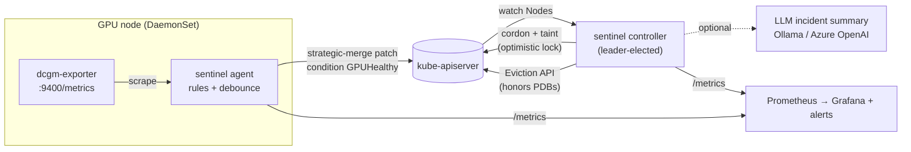

# GPU Fleet Sentinel

[](https://github.com/Nags-gk/gpu-fleet-sentinel/actions/workflows/ci.yaml)

**Automated GPU node health detection and safe remediation for Kubernetes.**
A Go node agent reads NVIDIA DCGM telemetry, detects hardware faults (XID errors,
uncorrectable ECC, row-remap failures, thermal events, missing GPUs), and a
controller-runtime controller quarantines bad nodes (cordon, taint, drain via
the Eviction API) without ever taking down more of the fleet than a configured
disruption budget allows.

On a large training cluster one bad GPU can stall a job running on thousands of
GPUs. The goal is to get a faulty node out of the scheduling pool in minutes, move
its workloads, and put it back automatically once it is healthy, without a
human in the loop and without a flapping sensor or a crashed exporter draining
healthy nodes.



## What it does

| Stage | Behavior |
|---|---|
| **Detect** | Agent scrapes dcgm-exporter every 15s and evaluates rules: hardware XIDs (48, 63, 64, 74, 79, 92, 94, 95, 119, 120) are critical; app-level XIDs (13, 31, 43) are warnings. Double-bit ECC, row-remap failure, temperature, SBE/NVLink CRC error *rates*, and missing GPUs are also covered. |
| **Debounce** | A node turns unhealthy after N consecutive critical samples and recovers only after M good ones (hysteresis), so one noisy reading never drains a node. |
| **Publish** | The agent writes a `GPUHealthy` node condition with a **strategic merge patch** keyed on condition type, so it never overwrites the kubelet's own conditions. Lost telemetry reports `Unknown`, never `False`. |
| **Decide** | A pure, fully unit-tested policy function chooses `Wait / Quarantine / Defer / Release` from node health, a grace period, a recovery period, heartbeat staleness, and the fleet-wide disruption budget. |
| **Remediate** | Cordon + `gpu-sentinel.io/unhealthy:NoSchedule` taint (optimistic-locked patch), then evict GPU pods through the Eviction API so PodDisruptionBudgets are honored. DaemonSet and mirror pods are skipped. |
| **Explain** | On quarantine, writes an incident summary to the node (runbook template by default; optionally an LLM via any OpenAI-compatible endpoint: Ollama, vLLM or Azure OpenAI, with automatic fallback). |
| **Recover** | After the recovery period the controller removes only what it added. A node a human had already cordoned stays cordoned. |
| **Observe** | Prometheus metrics, a Grafana dashboard, and alert rules with runbook links. |

## Safety properties (each covered by tests)

- **Disruption budget**: at most `max(maxUnavailable, maxUnavailablePercent × fleet)` nodes quarantined at once. Reconciles run with one worker so two nodes can't race for the last slot.
- **Stale or unknown health never triggers action**: a crashed agent or exporter is not evidence of a bad GPU.
- **PDB-blocked evictions never stall the fleet**: see *Engineering notes*.
- **Idempotent**: every step can be re-run after a crash mid-drain.
- **Least privilege RBAC**: the agent can only patch `nodes/status`; only the controller can cordon or evict.
- **Dry-run mode** for rolling out on a new cluster.

## Results

Measured with the simulated GPU backend. No physical GPUs were involved, so these validate the control loop, not real hardware telemetry.

| Test | Environment | Result |
|---|---|---|
| Unit tests (`go test -race`) | fake client | 81.7% statement coverage, race-clean |
| Integration test | real kube-apiserver + etcd (envtest), 3 GPU nodes + 1 CPU node | fault → quarantine in ~2s with a 2s grace period; PDB-protected pod kept; budget held under concurrent failures; automatic release |
| End-to-end test | kind, 4 workers, Helm install | fault → workload rescheduled to a healthy node → recovery; run `make e2e` (CI job `e2e`) |

## Quick start (laptop, no GPU required)

Prerequisites: Docker, [kind](https://kind.sigs.k8s.io/), kubectl, Helm, Go 1.24.

```bash
make kind-up        # 1 control plane + 4 "GPU" workers
make e2e            # build image, helm install, run hack/e2e.sh
```

Watch it live in a second terminal:

```bash
watch -n1 kubectl get nodes -L nvidia.com/gpu.present
make demo           # injects XID 79 on one node; press enter to clear it
```

Inject any fault directly:

```bash
kubectl -n gpu-sentinel port-forward ds/sentinel-agent 9500:9500 &
curl -X POST localhost:9500/debug/inject -d '{"gpu":3,"fault":"ecc-dbe"}'
curl localhost:9500/debug/report
# faults: xid79 xid48 xid13 overheat ecc-dbe row-remap sbe-storm nvlink-crc disappear none
```

Dashboards and alerts: [deploy/observability](deploy/observability).
Real GPUs on AKS: [docs/AKS.md](docs/AKS.md).

## Development

```bash
make test              # unit tests with the race detector
make test-integration  # controller + agents against a real kube-apiserver (envtest)
make lint              # golangci-lint
```

| Path | Contents |
|---|---|
| `internal/health` | Telemetry sources (DCGM scraper, simulator), rule engine, debouncer |
| `internal/remediation` | Pure decision policy |
| `internal/agent` | Node agent loop, condition publishing, HTTP/metrics/debug endpoints |
| `internal/controller` | Remediation reconciler, drain, eviction |
| `internal/incident` | Template and OpenAI-compatible / Azure OpenAI summarizers |
| `test/integration` | envtest suite |
| `deploy/helm` | Helm chart (DaemonSet, Deployment, RBAC, ServiceMonitor, PrometheusRule, dashboard) |
| `hack/e2e.sh` | kind end-to-end scenarios |

## Engineering notes

**PDB 429s and client-go retries.** The integration test against a real apiserver
exposed this. When a PodDisruptionBudget blocks an eviction, the apiserver returns
`429` with `Retry-After: 10`, and client-go transparently retries up to 10 times.
With a single reconcile worker, one protected pod blocked remediation for the
entire fleet for **1m40s** per attempt. Evictions now go through a REST call with
`MaxRetries(0)`: the 429 surfaces at once, the pod is counted as blocked, and only
that node is requeued. A regression test asserts the call returns in under 2s
with exactly one request.

**Pending pods bypass PDBs.** The Eviction API ignores PDBs for pods that are not
running. The integration test sets pod phase explicitly to exercise the real path.

**Condition timestamps have 1-second resolution**, so a grace period can fire up
to ~1s early. That is irrelevant at the default 2-minute grace period, and is
documented rather than hidden.

See [docs/ARCHITECTURE.md](docs/ARCHITECTURE.md) for design decisions and
trade-offs, and [docs/RUNBOOK.md](docs/RUNBOOK.md) for alert response.

## License

MIT
